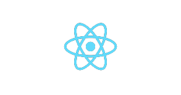
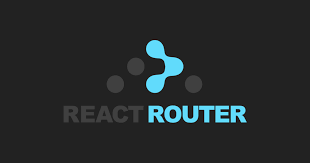
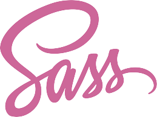
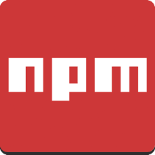
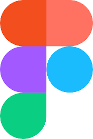

É agoniante programar todo dia e ver a frequencia do github baixa...

## Contato

 
 

<!-- 

## Principais projetos

| Projeto | Descrição | Função | Destaque | Status |
| ------- | --------- | ------ | -------- | ------ |
| 
  
 | Site de _flashcards_ | Desenvolvedor Front-end | - Foi realizado em equipe;   - As principais tecnologias foram: TypeScript e ReactJS | 
| 
  
 | Algoritmo que produz dados comparativos com de um Gnômon Eletrônico | Desenvolvedor Full Stack | Esse é o meu TCC para finalização do curso de informática do IFC |  |
| 
  
 | Blog que estou construindo para postar artigos | Desenvolvedor Front-end | - Está sendo realizado em equipe;   - As principais tecnologias são: TypeScript, ReactJS e NextJS | 

---- 

 ## Conhecimentos

|    JavaScript |    TypeScript |    NodeJS |    Prisma |
| -------------------------------- | -------------------------------- | -------------------------------- | -------------------------------- | 
| 
    ReactJS 
 |
    React Router 
|
    NextJS 
|
    Redux 
|
|
    HTML 
 |
    CSS 
|
    SASS 
 | 
    Tailwind 
 |
|
    Yarn 
 |
    NPM 
 |
    Git 
|
    Figma 
|
  -->
<!--  

Template

|
    
 |
    
 |
    
|
    
| 

-->
<!-- ---- -->

<!-- ## Dados do GitHub -->
<!--    -->
<!--  -->
<!-- 
 -->
<!-- ---- -->
<!-- 
## Entre em contato

 

 -->

<!--
**AlexandreXYZ/AlexandreXYZ** is a ✨ _special_ ✨ repository because its `README.md` (this file) appears on your GitHub profile.

Here are some ideas to get you started:

- 🔭 I’m currently working on ...
- 🌱 I’m currently learning ...
- 👯 I’m looking to collaborate on ...
- 🤔 I’m looking for help with ...
- 💬 Ask me about ...
- 📫 How to reach me: ...
- 😄 Pronouns: ...
- ⚡ Fun fact: ...
-->
